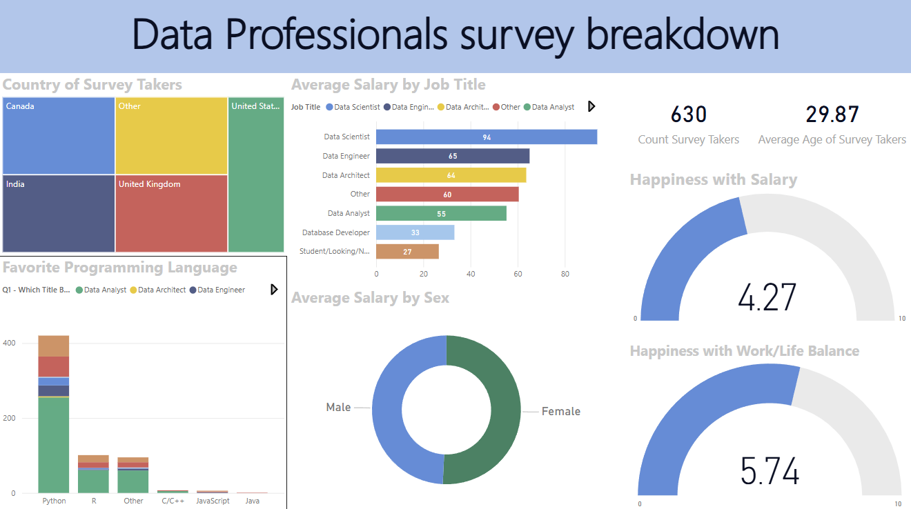

##  Data Professionals survey Analysis - Power Bi Project

## 📌 Overview

This project analyzes a global survey of data professionals to uncover trends in job roles, tools, salaries, education, and remote work. The data was cleaned and structured using Power Query Editor, then visualized in Power BI through interactive dashboards. The result is a clear, insight-driven report that reflects real-world business intelligence practices and highlights key patterns across the data industry.

## 🛠️ Tools & Technologies
- **Power BI Desktop** – Data visualization and dashboard creation  
- **Power Query Editor** – Data cleaning and transformation  
- **DAX** – Calculated columns, measures, and KPIs  
- **Excel** – Data sources

## 🔍 Key Features

### 📊 Interactive Dashboard
- Filterable by country 
- Visuals include charts, cards
- Simple, clear layout for easy insight discovery

### ✏️ Data Cleaning & Formatting
Cleaned and prepared raw survey data using **Power Query** (removed nulls, split columns, standardized values, etc.)

### 📈 KPIs & Metrics
  - Programing languages frequently used
  - Average salaries by job title
  - Average salaries by job sex
  - Happiness with salary
  - Happiness with work/life balance

## 📊Dashbord
 

## 📈 Insights Delivered
- Which countries offer the highest salaries to data professionals  
- How years of experience affect salary  
- Popular tools across different data roles  
- The growth of remote work opportunities  
- Relationship between education level and career path  
